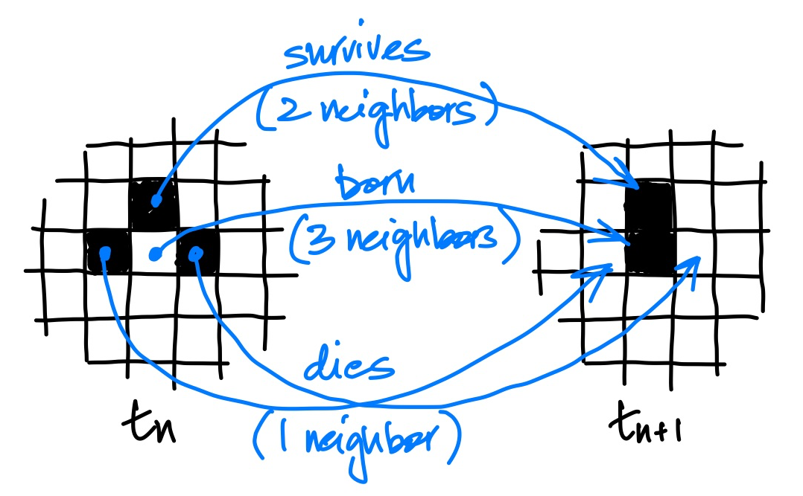
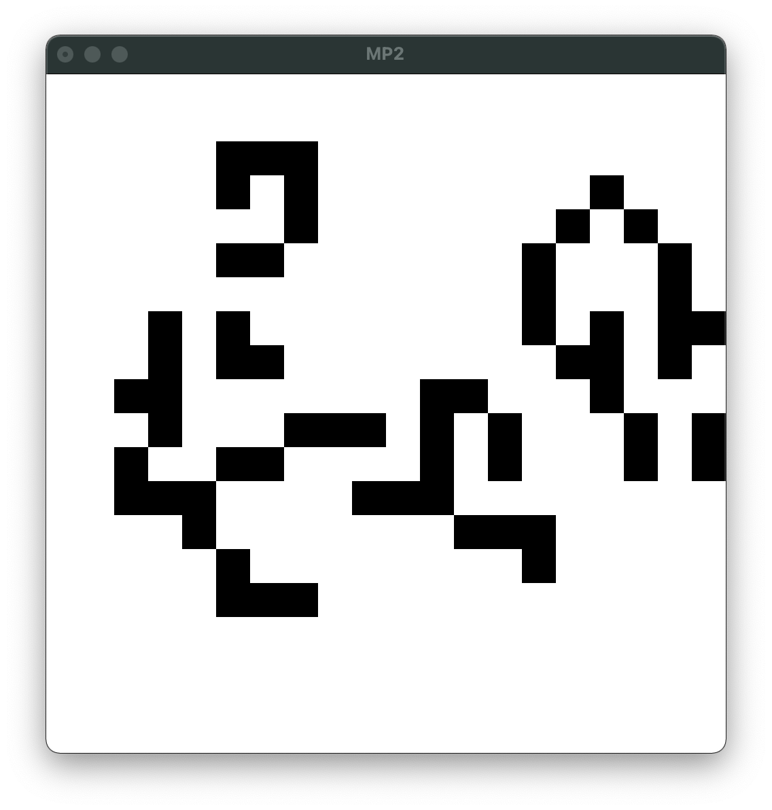
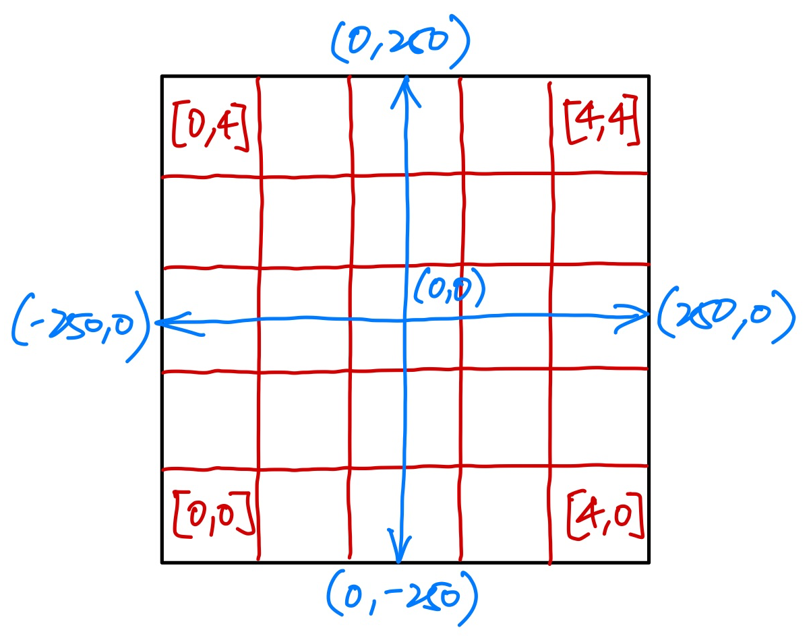
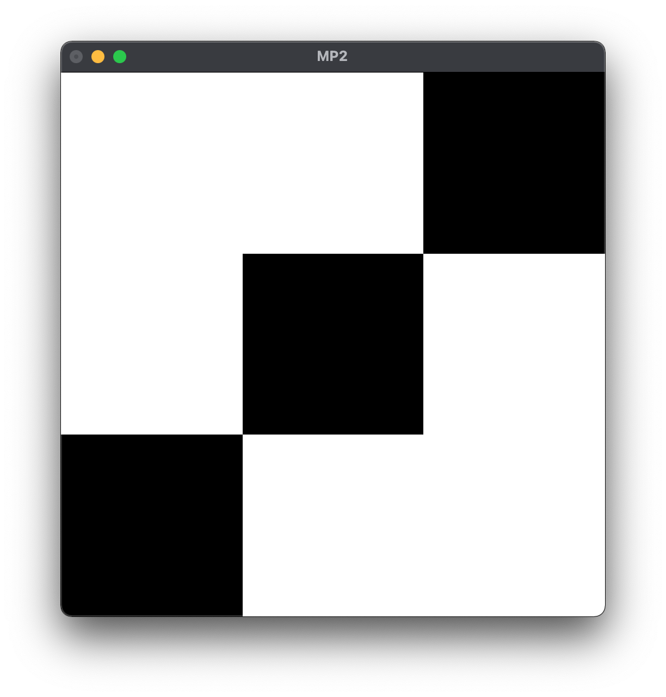

# CS 340 Machine Problem 2

## Overview

For this machine problem you'll write lots of functions that deal with lists.
Lists represent the simplest possible recursive data type that can hold an
arbitrary number of elements, and as such it is often the first type we reach
for when prototyping programs. You should learn to use them, and use them well!

## Signing the "package.yaml" file

As with the last machine problem, `git clone` your starter code, then sign the 
honor pledge in the "package.yaml" file before continuing. 

## Part A: Lists, Lists, Lists

In "src/MP2a.hs" you will find the declarations for ten function that you need
to implement, each prefaced by a comment containing a specification and sample
calls/results. 

Because the goal here is to practice writing list-processing functions from
scratch, you are to avoid using any list processing and higher-order functions
defined by the Haskell standard library. List comprehensions are technically
legal, but avoid them too if you can (just for now!). You may, however, use
arithmetic and character processing functions.

The functions you will implement are listed below, for reference:

1. `cycleN :: Int -> [a] -> [a]`

2. `chunksOf :: Int -> [a] -> [[a]]`

3. `unzip4 :: [(a,b,c,d)] -> ([a], [b], [c], [d])`

4. `intersperse :: a -> [[a]] -> [a]`

5. `removeAll :: (Eq a) => [a] -> [a] -> [a]`

6. `sublist :: (Int,Int) -> [a] -> ([a],[a])`

7. `luhn :: [Int] ->  Bool`

8. `runLengthEncode :: String -> [(Int,Char)]`

9. `runLengthDecode :: [(Int,Char)] -> String`

10. `vigenere :: String -> String -> String`

## Part B: Conway's Game of Life

### Introduction

John Conway's Game of Life is a well known "game" with a very simple set of
rules that can simulate incredibly sophisticated behavior (as sophisticated, in
fact, as any computer program). Its setting -- which we'll refer to as the
game's "world" -- is a two-dimensional grid of cells, each one either living or
dead, and considered to be in contact with its eight neighbors (i.e.,
orthogonally or diagonally adjacent cells).

Given the state of each cell in the world at time $t_n$, we can compute the
state of each cell at time $t_{n+1}$ (i.e., one generation later) using the
following rules:

- **Birth rule**: a dead cell with exactly three living neighbors comes alive.
- **Survival rule**: a living cell with two to three neighbors remains alive. 
- **Death rule**: a living cell with zero or one neighbors dies in isolation; a
  living cell with four or more neighbors dies of overcrowding

The image below depicts a world before and after the rules are applied to a
group of cells. 

Many living cell patterns have been discovered that result in
stable/non-changing shapes and repeatedly oscillating shapes, among other types
(see the [example patterns in the Game of Life Wikipedia
article](https://en.wikipedia.org/wiki/Conway%27s_Game_of_Life#Examples_of_patterns)
for some). An interesting fact about the Game of Life is that there is no
algorithm which can reliably predict whether or not a given pattern will appear
in the world given some starting state (this is related to the halting problem,
covered in CS 330).

Since each world state (after the initial state) is a pure function of the
preceding one, and the game world can be easily modeled using lists,
implementing the Game of Life makes for another fun list processing
exercise!

### Implementation in Haskell

We will represent the game world using the type: `((Int,Int), [[Bool]])`. I.e.,
as a tuple where the first element is a tuple of two integers $(w,h)$
representing the width and height of the world, and the second element is a list
of lists of Booleans representing the 2D grid, where each sublist of length
$w$ represents the cells in a row of the world, with $h$ sublists total.

A barren (i.e., containing only dead cells) world can be created with the
following function, which takes as input the width and height:

    makeWorld :: (Int,Int) -> ((Int,Int), [[Bool]])
    makeWorld dims@(w,h) = (dims, replicate h (replicate w False))

In "src/MP2b.hs" you will find declarations for functions you must complete to
implement the Game of Life. The first two functions compute the number of live
neighbors of a cell and the next world state:

    liveNeighbors :: ((Int,Int), [[Bool]])  -- world
                  -> (Int,Int)              -- cell
                  -> Int                    -- number of living neighbors

    nextWorld :: ((Int,Int), [[Bool]])      -- world 
              -> ((Int,Int), [[Bool]])      -- next world (one generation later)

To animate the game, you will need to write a function that returns a picture
for a given world state: 

    drawWorld :: ((Int,Int), [[Bool]])      -- world
              -> Picture                    -- graphical depiction of world

The picture of the world should be scaled to fit the fixed size 500x500 output
window, with cells depicted as squares in a 2D grid, shaded black/white (or
whatever color scheme you choose, provided it has reasonable contrast) to
indicate their status. Here's a screenshot of a running game:

To do your drawing, you will likely need to use the following functions from the
Gloss library: `color`, `rectangleSolid`, `scale`, `translate`, `pictures`.
Consult the [Gloss
documentation](https://hackage.haskell.org/package/gloss-1.13.2.1/docs/Graphics-Gloss-Data-Picture.html)
for details. The window coordinate system has (0,0) centered in the window, and
you will need to map your cells onto that coordinate system. To keep things
consistent, we ask that you map cells as shown below (the blue lines depict the
window coordinate system, while the red lines delineate a 5x5 cell grid -- your
implementation should work for grids of arbitrary size up to 50x50).

The easiest way to draw your world is to draw unit (1x1) squares for each cell
starting at (0,0), then translate and scale the entire resulting picture to fit
inside the window. The following code, for instance, produces the picture below
it:

    let w  = 500  -- screen width
        h  = 500  -- screen height
        n  = 3    -- number of squares
        sq = color black (rectangleSolid 1 1)  -- unit square
    in scale (w/n) (h/n) $
         translate (-n/2 + 0.5) (-n/2 + 0.5) $
           pictures [translate i i sq | i <- [0..n-1]]

Finally, you will implement a function that processes events in the window
affecting the world:

    handleEvents :: Event                   -- event (e.g., mouse button press)
                 -> ((Int,Int), [[Bool]])   -- world
                 -> ((Int,Int), [[Bool]])   -- next world (after processing event)

We provide a starter definition for the `handleEvents` function for you,
shown here:

    handleEvents :: Event -> ((Int,Int), [[Bool]]) -> ((Int,Int), [[Bool]])

    handleEvents 
        (EventKey (MouseButton LeftButton) Up _ (mx,my)) 
        world = undefined

    handleEvents _ world = world

The only event we're interested in is the left mouse button (or trackpad) click.
When the button is released, this function will be called with the event for
which we include a pattern match. The window coordinates where the click
occurred `(mx,my)` are found in the event, which you must map onto your cell
grid. Clicking on a cell forces it to be alive in the resulting world (the rest
of the world is unchanged).

When you're ready to test your animation and/or event handling code, run `stack
exec mp2` after a successful build. If you wish, you may tweak the starting
world state specified in "app/Main.hs" (it defaults to starting with a barren
landscape of 25x25 cells).

## Evaluation

We include test functions in "test/MP2aSpec.hs" and "test/MP2bSpec.hs" for you,
which you can run with the `stack test` command. The output of this command will
give you a full report on passing/failing functions.

Note that we only define working tests for the functions in part A. It isn't
required, but we *strongly* encourage you to write your own tests for
`liveNeighbors`, `nextWorld`, and any other top-level helper functions that you
write for part B. Even better, spec out your functions with tests *before*
starting to implement them for the satisfaction of watching test failures turn
into test successes!

Each function in part A is worth 4 points. The `liveNeighbors` and `nextWorld`
functions are worth 8 points each, and functioning drawing/animation and
event handling are worth 16 points. The assignment is worth a maximum of
$4\times10 + 2 \times 8 + 16 = 72$ points

## Submission

First, make sure you correctly signed and committed the "package.yaml" file.
Then, commit and push your changes to your GitHub repository.
